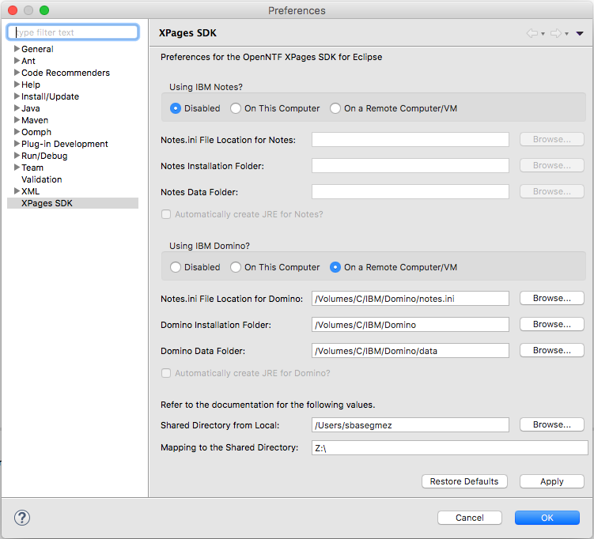

# OpenNTF XPages SDK for Eclipse

*Version 1.3.0 RC*

OPENNTF

    This project is an OpenNTF project, and is available under the Apache License V2.0.  
    All other aspects of the project, including contributions, defect reports, discussions,
    feature requests and reviews are subject to the OpenNTF Terms of Use - available at
    http://openntf.org/Internal/home.nsf/dx/Terms_of_Use.

## Introduction

OpenNTF XPages SDK for Eclipse is an Eclipse plugin designed for Eclipse IDE to integrate into IBM Notes/Domino OSGi frameworks.

This version has limited support for a remote server for developing OSGi plugins on IBM Notes/Domino environments.

## How to use?

First, download the proper release update site and extract into a folder on your computer. Then install the update site on your Eclipse using "Help\Install New Software…" menu action.

To start using the plugin, Go to your preferences and arrange your platform options in the XPages SDK Preference page.

Here, the page has three sections. The first two are about your Notes and Domino installations and the third one will be enabled if any of these platform is on a remote computer. So we have a couple of scenarios here:

#### Standard Configuration

Eclipse and the Domino environment are on the same computer by default. Configure your environment by selecting "On This Computer" for IBM Notes and/or Domino here. The third section will be disabled in this case. You can also check or uncheck "Automatically create JRE for Domino" depending on your choice. Right now, it makes sense to allow XPages SDK to create JRE for you so you will make sure you are developing towards a compatible JRE.

#### Remote Configuration

This is a scenario where you are using Eclipse on one computer but your development environment is on a remote computer or a VM. 

In this scenario, XPages SDK and your Notes/Domino environment will need file level access to each other. 

- Your Eclipse should be able to see IBM Notes/Domino installation and Data paths (1)
- IBM Notes and Domino should be able to see the Eclipse workspace (2)
  - In case your projects are out of your workspace (e.g. a separate Git folder), these folders should be accessible to the IBM Notes/Domino

The easiest way to accomplish (1) is to mount the C drive directly into your computer. If you are using a Windows VM, virtualization software can do it automatically. In such a case, you will end up with a path like "/Volumes/C/IBM/Domino" as shown above.

However, in some cases, this may not be convenient. If you are using a Linux VM, you might need to use different mount points for your VM, since Linux is using different directories for program files and data files for Domino. Also, in case of a Windows computer on a network, it might not be appropriate to share the root drive on the network.  In such a case, you might create two different mounts like "/Volumes/DominoProgram" and "/Volumes/DominoData". 

We specifically request access to notes.ini file to resolve the IBM Notes/Domino directories for path conversions.

For (2), it's rather complicated. Because your Eclipse projects might be in different directories on your computer and Domino should be able to see all of those folders. So we define a junction point for this (3rd section in the preferences page). Here we decide a directory on our computer and map this directory on the remote computer. Selecting this directory is critical in the way that it must be a common root directory for your workspace and all project directories.

As an example, suppose you are using "~/Eclipse/MyWorkspace" as the workspace directory. Some of your projects might be in your workspace but some might be in "~/Projects" directory. In such a case, you can map your home folder (/Users/YourUserName) in the VM as a drive (e.g. Z:\ above). 

### Gotchas

- When using a remote scenario, "Automatically Create JRE" option will be disabled. We have good reasons for this. The primary reason is that you will probably end up with different OS'es in such a scenario and JRE will not be usable. Also, even you use the same OS, you don't want to use a JRE from a remote VM to avoid a dependency issue.
- XPages SDK needs to resolve all plugins installed on your Domino server to create config.ini file. This is why we are dealing with so many conversion issues. Because to be able to detect the list of plugins loaded on Domino server, Eclipse will scan the remote Domino folders, find the plugins and write them into the config.ini file in a way Domino to access. This is the same for your plugin projects in your computer.
- Domino supports .link files in OSGi. These files resides in "*domino_install*\osgi\rcp\eclipse\links" folder. These are generally used to support add-ons to the Domino server. Social plugin or Upgrade pack uses *.link* files to append their own plugins. Developers can also take advantage of link files to add additional bundles to Domino server. However, when you use a launcher from the Eclipse IDE, link files will be ignored by Domino server. So XPages SDK resolves all link files to create additional bundles if needed. One caveat here is that link files should point some directory under Domino installation or Data folder. This is already the case for the default installation.

## How to Contribute

Submit your feature requests and bug reports into [XPagesSDK Jira Project Page](https://jira.openntf.org/projects/XSPSDK).

Let me know if you want to contribute in any way :)

## What is New?

### Version 1.3.0

- (FEATURE) New Preferences page for more control over the Notes/Domino installation
- (FEATURE) Added Support for remote Notes/Domino environment on Launch Framework
- (FIX) Added "Create Notes Java API Project" back.
- (MISC) Cleared unused classes and extensions
- (MISC) Refactored class names
- (MISC) Better path and environment handling with NotesDominoPlatform classes 

## Known Issues

- No support for *.link* files pointing out of Notes/Domino installation and data folders
- No support for IBM Domino Designer as an OSGi framework

